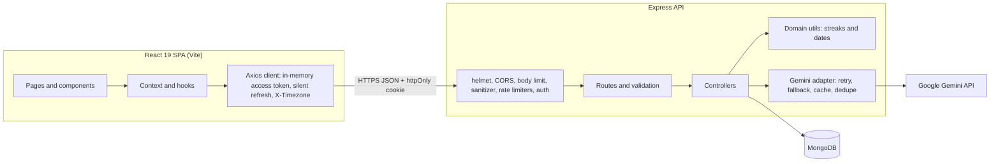
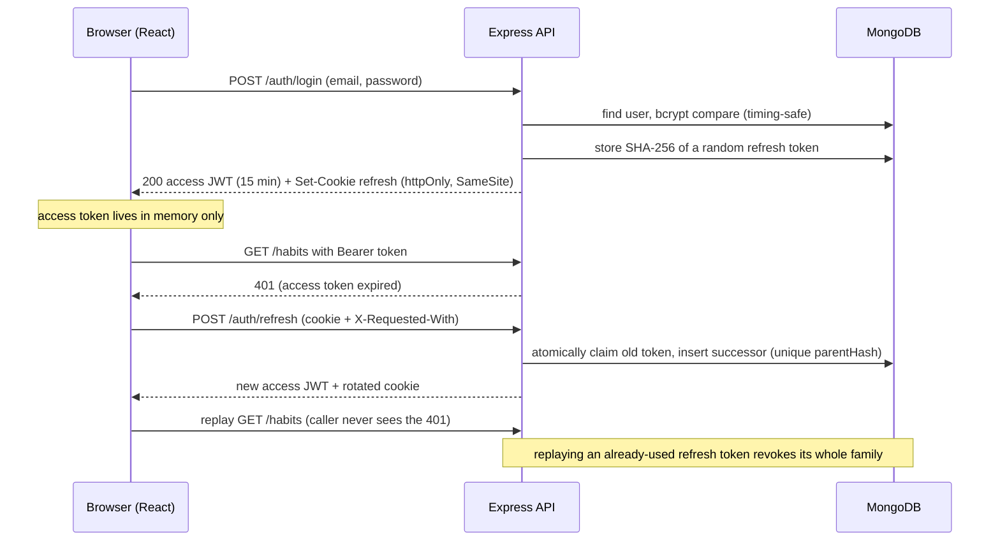
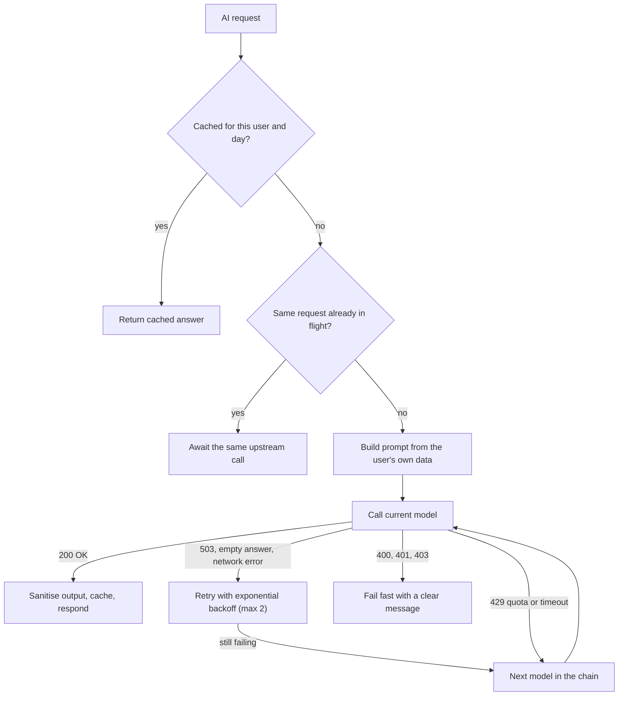
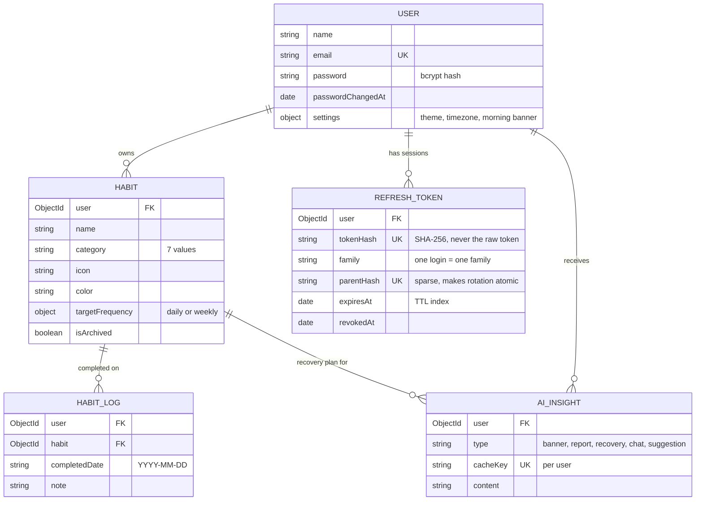

<div align="center">

# 🪐 Momentum — AI-Powered Habit Tracker

**A full-stack MERN app that turns habit tracking into a coaching experience: five Gemini-powered AI features grounded in your own data, timezone-correct streaks, and production-style authentication.**

[](https://github.com/OWNER/REPO/actions/workflows/ci.yml)


[Features](#-features) · [Architecture](#-architecture) · [Quick start](#-quick-start) · [Logging in](#-logging-in-and-first-run) · [API](#-api-reference) · [Security](#-security) · [Testing](#-testing--ci) · [Troubleshooting](#-troubleshooting)


<sub>Screenshots use seeded demo data; the AI text shown is sample output.</sub>

</div>

---

## Why this project is worth a look

| | |
|---|---|
| 🤖 **AI that is actually grounded** | Five features (banner, suggestion wizard, streak-recovery coach, weekly report, data chatbot) built on the user's real data. The chatbot receives pre-computed per-weekday statistics, because LLMs are unreliable at calendar arithmetic. Model output is never trusted: JSON is extracted defensively, enums are normalised, lengths are capped. |
| 🛡️ **AI layer built for the real world** | Gemini regularly answers `503 The model is overloaded`. Requests are classified (fatal / transient / quota / timeout / retired model), retried with exponential backoff, then fall back through a model chain, all inside a bounded time budget. Identical concurrent requests share one upstream call. |
| 🔐 **Production-style authentication** | 15-minute access JWT held **in memory only**, plus a single-use, **rotating refresh token in an httpOnly cookie**. Reuse detection revokes the whole token family; a unique DB constraint makes concurrent rotation race-safe. |
| 🕒 **Timezone-correct streaks** | The browser sends its IANA zone; the server derives "today" from it. No UTC off-by-one for users at 00:30 in Asia/Kolkata. |
| ✅ **Tested and automated** | **156 server tests** (~95 % statement coverage) against a real database and a fake Gemini, **50 client tests**, and a GitHub Actions matrix on Node 20 and 22. |
| ✨ **Polished UI** | Glassmorphism, animated aurora, an interactive orbital "habit solar system", progress rings, confetti, light/dark mode with no flash, keyboard-operable controls and `prefers-reduced-motion` support. |

---

## ✨ Features

### Habit tracking
- **Daily checklist** with a weekly progress ring around every check-off button and a 7-day consistency strip.
- **Streaks**: current and all-time best, calculated across month, year and leap-day boundaries.
- **Custom habits**: category (7), icon (18) and colour; archive (soft, keeps history) or delete.
- **Habit solar system**: each habit is an orbiting planet around a sun that shows today's completion. Hover to pause the orbit, click (or press <kbd>Enter</kbd>) to check a habit off.
- **Celebrations**: confetti on completion, a bigger burst when *everything* is done.
- **Idempotent check-ins**: a unique `(user, habit, date)` index means double-clicks and two open tabs can never create duplicate logs.

### Analytics (Insights page)
- **Weekly consistency grid**: habits × last 7 days.
- **This week vs last week** grouped bar chart, **completions-by-category** donut, and a **habit ranking** with progress bars.
- **90-day GitHub-style heat map** per habit, aligned to real weekdays, in the habit's own colour.

### The 5 AI features (Gemini)

| # | Feature | What it does | Engineering detail |
|---|---|---|---|
| 1 | **Morning motivation banner** | 1–2 personalised sentences referencing your real habits and streaks | Cached per user per day; respects a per-user on/off setting |
| 2 | **Habit suggestion wizard** | 3-step wizard (goals → peak energy time → past struggles) returning 3 tailored habits you add in one click | JSON mode; categories normalised to the enum; capped at 3; unreadable output → clear error, not an empty list |
| 3 | **Streak recovery coach** | Detects a recently broken **7+ day** streak and writes a 3-day comeback plan | One server-side scan of *all* habits per page load; plan disappears once you complete the habit again |
| 4 | **Weekly AI report** | 120–180 word summary of wins, struggles, patterns and tips from the last 7 days | Cached per day (not per calendar week, so it never goes stale); manual regenerate button |
| 5 | **Data chatbot** ("Ask your data") | Answers questions like *"Which day am I most consistent?"* | Grounded in 30 days of your data plus pre-computed weekday stats; short conversation memory; prompt-injection guard; **Try again** on failure |


## 🧱 Tech stack

| Layer | Technology |
|---|---|
| **Frontend** | React 19, Vite 5, Tailwind CSS v4, React Router 6, Axios, Recharts, Lucide icons, canvas-confetti, react-markdown |
| **Backend** | Node.js ≥ 20 (ES modules), Express 4, Mongoose 8, `helmet`, `cookie-parser`, `cors`, `jsonwebtoken`, `bcryptjs`, `date-fns` |
| **Database** | MongoDB (Atlas or local) |
| **AI** | Google Gemini via `@google/genai` (default `gemini-2.5-flash`, configurable, with fallback chain) |
| **Testing** | Vitest, Supertest, React Testing Library, jsdom, an in-process fake Gemini server |
| **CI** | GitHub Actions (Node 20 + 22, MongoDB service container, coverage, build, `npm audit`) |

---

## 🏛 Architecture

### System overview



### Request pipeline (middleware order)

`helmet` → `cors` (allow-list) → `express.json` (100 KB limit) → `cookie-parser` → **sanitizer** (strips `$operators`, dotted keys, `__proto__`) → **global rate limiter** (300/min/IP) → route → **`protect`** (JWT, HS256 pinned, password-change check) → route-specific limiters (per-user AI limiter, failed-login limiter) → validation → controller → **central error handler** (maps Mongoose/JSON/JWT errors to proper 4xx, never leaks stack traces).

### Authentication flow (rotating refresh tokens)



### AI request pipeline



Failures are translated to **safe** HTTP statuses. A Gemini `401/403` is never forwarded as `401`, because the SPA treats `401` as "session expired" and would log the user out.

### Data model



**Key indexes:** `HabitLog (user, habit, completedDate)` unique · `AIInsight (user, cacheKey)` unique · `RefreshToken.tokenHash` unique · `RefreshToken.parentHash` unique + sparse · `RefreshToken.expiresAt` TTL (expired sessions are deleted by MongoDB itself).

### Key design decisions

| Decision | Why |
|---|---|
| Completion dates stored as `"YYYY-MM-DD"` strings + `X-Timezone` header | Streaks are calendar concepts. Timestamps in UTC put a completion at 00:30 IST on the wrong day; strings plus a shared notion of "today" remove that whole bug class. |
| Access token in memory, refresh token in an httpOnly cookie | XSS can't read a long-lived credential from `localStorage`; the cookie is scoped to `/api/v1/auth` and can't be read by JavaScript. |
| Single-use refresh tokens with family revocation and a unique `parentHash` | A stolen token is detected on reuse; the database itself guarantees only one concurrent refresh wins. |
| Retry → fallback → time budget in the Gemini adapter | Google's own guidance for `503`; keeps the UI responsive (server budget 40 s < browser timeout 75 s). |
| Cache AI output per user per day + in-flight de-duplication | React StrictMode and multiple tabs would otherwise multiply paid calls. |
| Pre-computed weekday statistics in the chat prompt | The model answers "best day?" from numbers instead of guessing weekdays from dates. |
| Streak-recovery detection runs server-side across all habits in one request | The first client version fired one AI request *per habit* on every refresh and exhausted the rate limit. |
| Independent rate-limiter stores | An earlier shared store let normal traffic starve the AI limiter (regression-tested). |
| Untrusted model output is normalised, not rendered raw | Categories forced into the enum, JSON extracted from fenced/chatty text, strings capped. |

---

## 🚀 Quick start

### Prerequisites
- **Node.js ≥ 20** (`node -v`)
- **A MongoDB database**: [MongoDB Atlas](https://www.mongodb.com/atlas) free tier, *or* local via Docker
- **A Gemini API key** (free): <https://aistudio.google.com/apikey>. Without one the app still runs, but the AI cards show a clear "not configured" message.

### 1. Get the code
```bash
git clone https://github.com/OWNER/REPO.git
cd REPO            # the folder that contains /client and /server
```

### 2. Database (pick one)

**Local with Docker**
```bash
docker run -d --name habit-mongo -p 27017:27017 mongo:7
# then use:  MONGODB_URI=mongodb://127.0.0.1:27017/habit-tracker
```

**MongoDB Atlas**: create a free cluster → *Database Access* (create a user) → *Network Access* (allow your IP) → *Connect → Drivers* and copy the connection string. URL-encode special characters in the password.

### 3. Configure the backend
```bash
cd server
cp .env.example .env            # Windows CMD: copy .env.example .env   |   PowerShell: Copy-Item .env.example .env
```

Generate a strong `JWT_SECRET`:
```bash
node -e "console.log(require('crypto').randomBytes(48).toString('base64url'))"
```

Edit `server/.env` (no quotes, no spaces around `=`):
```env
PORT=5000
MONGODB_URI=mongodb://127.0.0.1:27017/habit-tracker
JWT_SECRET=<paste the generated secret>
GEMINI_API_KEY=<your Gemini key>
CLIENT_URL=http://localhost:5173,http://127.0.0.1:5173
```

> ⚠️ The server reads `.env` **only at startup**: restart it after every change. Never commit `.env` (it is git-ignored).

### 4. Install, verify and (optionally) seed
```bash
npm install
npm run doctor      # checks Node, .env, MongoDB, and makes one real Gemini call
npm run seed        # optional: demo user + 90 days of realistic data (see "Logging in")
```

### 5. Run the backend (terminal 1)
```bash
npm run dev         # nodemon; use `npm start` for plain node
```
Expect `MongoDB connected` and `Server running on http://localhost:5000`. Health check: <http://127.0.0.1:5000/api/v1/health> → `{"status":"ok", ...}`.

### 6. Run the frontend (terminal 2)
```bash
cd client
npm install
npm run dev
```
Open **<http://localhost:5173>**.

### Everyday commands

| Task | Command |
|---|---|
| Start API | `cd server && npm run dev` |
| Start UI | `cd client && npm run dev` |
| Diagnose setup / AI | `cd server && npm run doctor` |
| Reset demo data | `cd server && npm run seed` |
| Run all backend tests | `cd server && npm test` |
| Run all frontend tests | `cd client && npm test` |
| Production build of the UI | `cd client && npm run build` (output in `client/dist`) |

| Service | URL |
|---|---|
| Frontend | <http://localhost:5173> |
| API | <http://localhost:5000/api/v1> |
| Health | <http://localhost:5000/api/v1/health> |

<details>
<summary><b>Changed the API port?</b></summary>

If you set `PORT=5001` in `server/.env` (for example because macOS AirPlay uses 5000), tell the dev proxy:
```bash
# client/.env
VITE_API_PROXY_TARGET=http://127.0.0.1:5001
```
Then **restart** `npm run dev` in `client/`.
</details>

---

## 🔑 Logging in and first run

### Option A: demo account (fastest)
After `npm run seed`:

| Email | Password |
|---|---|
| `demo@habittracker.app` | `password123` |

The seed creates 7 habits with 90 days of history, including **"Evening Stretch", a 12-day streak that ended 3 days ago**, so the **Streak Recovery Coach** appears immediately.

### Option B: create your own account
1. Open <http://localhost:5173>; you are redirected to **/login**.
2. Click **Sign up**, enter a name, e-mail and a password (**8–72 characters, at least one letter and one number**).
3. You are signed in and land on the dashboard. Add habits with **New habit**, or let the AI propose some with **Suggest habits**.

### What happens under the hood
1. `POST /auth/login` returns a 15-minute **access token** (kept in memory) and sets an **httpOnly refresh cookie**.
2. When the access token expires, the client silently calls `POST /auth/refresh`; the cookie is rotated and the failed request is replayed. You stay signed in for up to 7 days.
3. Reloading the page restores your session from the cookie (a non-secret `momentum_session` hint in `localStorage` only tells the app whether to try).
4. **Logout** revokes the session server-side; **Sign out on all devices** (🛡 *Account security* dialog) revokes every session.

### Manage your account
- Click the **🛡 shield icon** in the navbar → **Account security** → change your password. All other devices are signed out and older access tokens are rejected.
- Failed logins are rate-limited (10 per 15 minutes per IP+e-mail). The UI shows how long to wait.

### Configure authentication (optional `server/.env`)
```env
ACCESS_TOKEN_TTL=15m          # access-token lifetime
REFRESH_TOKEN_TTL_DAYS=7      # session length
COOKIE_SAMESITE=lax           # lax | strict | none (cross-site deployments; forces Secure)
AUTH_RATE_LIMIT_MAX=10        # failed logins per IP+email per 15 min
REGISTER_RATE_LIMIT_MAX=20    # sign-ups per IP per hour
BCRYPT_ROUNDS=12
```

### Try the API from the command line
```bash
# 1) log in and keep the refresh cookie
curl -s -c cookies.txt -X POST http://localhost:5000/api/v1/auth/login \
  -H "Content-Type: application/json" \
  -d '{"email":"demo@habittracker.app","password":"password123"}'
# copy the "token" value from the response:
TOKEN="<paste token here>"

# 2) call a protected endpoint
curl -s http://localhost:5000/api/v1/habits \
  -H "Authorization: Bearer $TOKEN" -H "X-Timezone: Asia/Kolkata"

# 3) rotate the refresh token (the custom header is a CSRF defence)
curl -s -b cookies.txt -c cookies.txt -X POST http://localhost:5000/api/v1/auth/refresh \
  -H "X-Requested-With: XMLHttpRequest"

# 4) ask the AI chatbot
curl -s -X POST http://localhost:5000/api/v1/ai/chat \
  -H "Authorization: Bearer $TOKEN" -H "Content-Type: application/json" \
  -d '{"message":"Which day am I most consistent?"}'
```

---

## ⚙️ Environment variables

### Server (`server/.env`)

| Variable | Required | Default | Purpose |
|---|:---:|---|---|
| `MONGODB_URI` | ✅ | | MongoDB connection string |
| `JWT_SECRET` | ✅ | | Signs access tokens. **≥ 32 chars required when `NODE_ENV=production`** |
| `GEMINI_API_KEY` | for AI | | Google AI Studio key |
| `PORT` | | `5000` | API port |
| `CLIENT_URL` | | `http://localhost:5173,http://127.0.0.1:5173` | CORS allow-list (comma-separated origins) |
| `GEMINI_MODEL` | | `gemini-2.5-flash` | Primary model |
| `GEMINI_FALLBACK_MODELS` | | `gemini-3.6-flash,gemini-2.5-flash-lite` | Tried in order when the primary is overloaded, rate-limited, hanging or retired |
| `GEMINI_MAX_RETRIES` | | `2` | Extra attempts per model (exponential backoff) |
| `GEMINI_TIMEOUT_MS` | | `20000` | Per-attempt timeout |
| `GEMINI_TOTAL_BUDGET_MS` | | `40000` | Time budget across all retries and models |
| `ACCESS_TOKEN_TTL` | | `15m` | Access-token lifetime |
| `REFRESH_TOKEN_TTL_DAYS` | | `7` | Refresh-token / session lifetime |
| `COOKIE_SAMESITE` | | `lax` | `lax`, `strict` or `none` |
| `AUTH_RATE_LIMIT_MAX` | | `10` | Failed logins per IP+email / 15 min |
| `REGISTER_RATE_LIMIT_MAX` | | `20` | Sign-ups per IP / hour |
| `BCRYPT_ROUNDS` | | `12` | Password hashing cost |
| `TRUST_PROXY` | | unset | Set to `1` behind a reverse proxy so client IPs are correct |
| `NODE_ENV` | | | `production` adds the `Secure` cookie flag and enforces the secret length |
| `TEST_MONGODB_URI` | tests | `mongodb://127.0.0.1:27017/habit-tracker-test` | Database wiped by `npm test` (**name must contain "test"**) |

### Client (`client/.env`, optional)

| Variable | Purpose |
|---|---|
| `VITE_API_PROXY_TARGET` | Dev-proxy target if the API is not on `http://127.0.0.1:5000` |
| `VITE_API_URL` | Absolute API origin when frontend and backend are deployed separately |

---

## 📚 API reference

Base URL: `http://localhost:5000/api/v1` · JSON in/out · protected routes need `Authorization: Bearer <access token>` · send `X-Timezone: <IANA zone>` so "today" is correct.

| Method | Endpoint | Auth | Description |
|---|---|:---:|---|
| `GET` | `/health` | | Status, timestamp, whether AI is configured and the model chain (never the key) |
| **Auth** | | | |
| `POST` | `/auth/register` | | Create account → access token + refresh cookie |
| `POST` | `/auth/login` | | Log in (failed attempts rate-limited) |
| `POST` | `/auth/refresh` | cookie | Rotate refresh token, get a new access token (needs `X-Requested-With: XMLHttpRequest`) |
| `POST` | `/auth/logout` | cookie | Revoke this device's session |
| `POST` | `/auth/logout-all` | ✅ | Revoke every session |
| `POST` | `/auth/change-password` | ✅ | Change password; signs out other devices |
| `GET` | `/auth/me` | ✅ | Current user |
| `PATCH` | `/auth/settings` | ✅ | Update theme / timezone / morning banner (whitelisted fields only) |
| **Habits** | | | |
| `GET` | `/habits?includeArchived=` | ✅ | List habits with streaks, `completedToday` and a 7-day strip (2 queries total) |
| `POST` | `/habits` | ✅ | Create a habit |
| `GET` | `/habits/:id` | ✅ | Habit + streaks + 90-day heat map + logs |
| `PATCH` | `/habits/:id` | ✅ | Update (whitelisted fields) |
| `PATCH` | `/habits/:id/archive` | ✅ | Toggle archive |
| `DELETE` | `/habits/:id` | ✅ | Delete habit and its logs |
| **Logs** | | | |
| `POST` | `/logs/toggle` | ✅ | Check/uncheck a habit `{ habitId, date? }` (idempotent; future dates rejected) |
| `GET` | `/logs?habitId=&from=&to=` | ✅ | Query completions |
| `GET` | `/logs/weekly-summary` | ✅ | This week, last week and daily flags per habit |
| **AI** *(per-user limit: 30/min)* | | | |
| `GET` | `/ai/morning-banner` | ✅ | Personalised greeting (cached per day) |
| `POST` | `/ai/suggest-habits` | ✅ | `{ goals, peakEnergyTime?, pastStruggles? }` → 3 suggestions |
| `GET` | `/ai/streak-recovery` | ✅ | Scans all habits; up to 2 comeback plans |
| `GET` | `/ai/streak-recovery/:habitId` | ✅ | Single-habit variant |
| `GET` | `/ai/weekly-report?refresh=true` | ✅ | 120–180 word report (cached per day) |
| `POST` | `/ai/chat` | ✅ | `{ message, history? }` → answer grounded in 30 days of data |

**Errors** are always `{ "success": false, "message": "…" }` with meaningful codes: `400` validation, `401` auth, `403` missing CSRF header, `404`, `409` duplicate, `413` body too large, `429` rate limit (with `Retry-After`), `502/503/504` upstream AI problems (with Google's reason).

---

## 🛡 Security

| Area | Implementation |
|---|---|
| **Sessions** | Access JWT (15 min, HS256 pinned, in memory) + opaque 7-day refresh token in an **httpOnly, SameSite** cookie scoped to `/api/v1/auth`. Only a **SHA-256 hash** of the refresh token is stored. |
| **Token theft** | Refresh tokens are **single-use and rotated**. Replay of a used token revokes the whole family; a unique `parentHash` index guarantees exactly one concurrent refresh succeeds. |
| **CSRF** | SameSite cookie + a required custom `X-Requested-With` header on cookie-authenticated endpoints. |
| **Passwords** | bcrypt (cost 12), 8–72 chars with letter + number, timing-safe login (no user enumeration), password change invalidates other sessions and older access tokens. |
| **Brute force** | Failed-login limiter per IP+email and per IP (successful logins don't count), sign-up limiter, per-user AI limiter, global limiter. |
| **Injection** | Sanitizer strips `$operators`, dotted keys and `__proto__`; inputs are type-coerced; **every query is scoped to the authenticated user** (IDOR is tested). |
| **Headers / transport** | `helmet` (CSP, HSTS, nosniff, frame denial…), strict CORS allow-list, 100 KB body limit, `x-powered-by` removed. |
| **Errors** | No stack traces or internals in responses; upstream Gemini failures never surface as `401`. |
| **AI safety** | The chat prompt instructs the model to ignore instructions inside the user message; history roles are whitelisted; model output is normalised before use. |

**Deploying?** Set `NODE_ENV=production`, a 32+ character `JWT_SECRET` (the server refuses to start otherwise), `CLIENT_URL` to your frontend origin, and `TRUST_PROXY=1` behind a reverse proxy. If the frontend and API live on **different sites** (e.g. `*.vercel.app` + `*.onrender.com`) set `COOKIE_SAMESITE=none` and `VITE_API_URL`, but note some browsers (notably Safari) block third-party cookies. Serving both under one domain, or proxying `/api` through the frontend host, is more reliable.

---

## 🧪 Testing & CI

```bash
# Backend needs a MongoDB (e.g. docker run -d -p 27017:27017 mongo:7)
cd server
npm test                  # 156 tests
npm run test:coverage     # ~95% statements, ~86% branches

cd ../client
npm test                  # 50 tests
npm run test:coverage
```

| Suite | What it proves |
|---|---|
| **Unit** | Streak maths (month/year/leap boundaries, broken-streak detection), date & timezone helpers, rate limiter, NoSQL-injection sanitizer, Gemini config and JSON extraction, startup-config regression guards |
| **Integration** (real Express app + real MongoDB + **fake Gemini**, no network, no quota) | Whole auth lifecycle (rotation, reuse detection, concurrent refresh, logout-all, change-password), brute-force lockout, CORS, cookie flags, security headers, IDOR, all habit/log endpoints, **all 5 AI features** (prompts, caching, sanitising, per-user isolation) and every Gemini failure mode (quota, invalid key, retired model, hang, overload, empty answer) |
| **Client** | Progress ring, orbit system (mouse + keyboard), heat map weekday alignment, chat (incl. retry), login page, change-password dialog, API client token-refresh logic (single-flight, replay, race, no infinite loop) |

**Test design notes**
- The backend suite **refuses to run unless the database name contains `test`**, because it wipes the database.
- Gemini is replaced by an in-process fake that can simulate quota errors, invalid keys, retired models, 503 overloads, hangs and empty answers.
- Tests were **mutation-checked**: re-introducing three original bugs (shared rate-limit store, disabled reuse-detection, `.env` loaded after imports) makes the suite fail.

**CI** (`.github/workflows/ci.yml`): on every push and pull request, both suites run on **Node 20 and 22** (MongoDB service container), the client is built, and an informational `npm audit` runs. Replace `OWNER/REPO` in the badge at the top with your repository.

---

## 🗂 Project structure

```
.
├── .github/workflows/ci.yml        # CI: tests (Node 20/22), build, audit
├── docs/screenshots/               # README images
├── LICENSE
├── client/                         # React 19 + Vite SPA
│   └── src/
│       ├── pages/                  # Dashboard, Insights, Login, Register
│       ├── components/             # OrbitSystem, CompletionRing, HabitChecklist, HeatMap,
│       │                           # StatsCharts, WeeklyGrid, AIChat, AIWizard, MorningBanner,
│       │                           # StreakRecovery, ChangePassword, Navbar, HabitForm
│       ├── context/                # AuthContext (session restore), ThemeContext
│       ├── hooks/                  # useHabits
│       ├── services/               # api.js (token refresh + timezone), auth/habit/log/ai services
│       └── utils/                  # constants, error messages, formatters
└── server/                         # Express API
    ├── server.js                   # entry point (loads .env first, env validation, port errors)
    ├── scripts/                    # seed.js (demo data), doctor.js (setup diagnostics)
    ├── src/
    │   ├── app.js                  # middleware pipeline + route mounting
    │   ├── config/                 # db.js, gemini.js (retry / fallback / classification)
    │   ├── routes/                 # auth, habits, logs, ai (+ per-route limiters)
    │   ├── controllers/            # authController, habitController, logController, aiController
    │   ├── middlewares/            # auth, sanitize, rateLimiter, validate, errorHandler
    │   ├── models/                 # User, Habit, HabitLog, RefreshToken, AIInsight
    │   └── utils/                  # streaks, dates (timezone), tokens, errors, logger
    └── tests/                      # unit/, integration/, helpers/ (fake Gemini, DB bootstrap)
```

---

## 📈 Performance & quality notes

- Habit list: **two queries total** (habits + all logs), not one per habit.
- Streak recovery: **one request** scans every habit server-side; Gemini is called only when a streak actually broke.
- AI results cached per user per day; concurrent identical requests share one upstream call.
- UI updates in place on check-off (no full-list reload flicker); double-clicks are ignored while a request is in flight.
- Icons are imported individually; the production bundle is **~925 KB (~274 KB gzipped)**. Route-level code-splitting is on the roadmap.
- Accessibility: labelled controls, keyboard-operable planets (<kbd>Enter</kbd>/<kbd>Space</kbd>), visible focus rings, `aria-pressed` states, `prefers-reduced-motion` support.

---

## 🩺 Troubleshooting

Run **`cd server && npm run doctor`** first: it checks Node, `.env`, MongoDB and a live Gemini call, and tells you what's wrong.

<details>
<summary><b>"Can't reach the API server" or the AI cards show a connection error</b></summary>

The backend isn't running or the ports don't match. Start `npm run dev` in `server/`, open <http://127.0.0.1:5000/api/v1/health>, and if you changed `PORT` set `VITE_API_PROXY_TARGET` in `client/.env` (then restart the client).
</details>

<details>
<summary><b>Server exits: "Missing required environment variable(s)"</b></summary>

`server/.env` is missing or incomplete. A fresh unzip/clone has no `.env`; copy `.env.example` and fill it in.
</details>

<details>
<summary><b>MongoDB connection error</b></summary>

Atlas: add your IP under *Network Access*, check the user/password (URL-encode special characters). A `querySrv` error means your network blocks SRV DNS lookups: try another network/DNS or Atlas's standard (non-SRV) connection string.
</details>

<details>
<summary><b>"Port 5000 is already in use"</b></summary>

Another program holds it (on macOS, *AirPlay Receiver*). Set `PORT=5001` in `server/.env` and `VITE_API_PROXY_TARGET=http://127.0.0.1:5001` in `client/.env`.
</details>

<details>
<summary><b>AI: "AI is not configured" / "Gemini rejected your API key"</b></summary>

`GEMINI_API_KEY` is missing, still the placeholder, has quotes/spaces, or the key lacks access. Fix `.env`, restart the server, run `npm run doctor`.
</details>

<details>
<summary><b>AI: "Gemini is temporarily unavailable (HTTP 503: The model is overloaded)"</b></summary>

Google-side capacity problem for that model (not your key or quota). The server already retries with backoff and falls back to other models; if it still appears, every model was busy. Press **Try again** or retry in a minute. The message lists the models tried; you can change `GEMINI_MODEL` / `GEMINI_FALLBACK_MODELS`.
</details>

<details>
<summary><b>AI: "rate/quota limit was reached"</b></summary>

Free-tier Gemini quota (per model, per minute/day). Wait, or enable billing in Google AI Studio.
</details>

<details>
<summary><b>Login problems</b></summary>

- *"Invalid email or password"*: check credentials; the demo user exists only after `npm run seed`.
- *"Too many failed login attempts"*: wait for the time shown (10 failures per 15 min per IP+e-mail).
- *Signed out unexpectedly*: your session expired (7 days) or was revoked by a password change or "Sign out on all devices".
- *Blank page in dev*: make sure there is **no** `client/postcss.config.js`; Tailwind v4 loads through the Vite plugin only.
</details>

<details>
<summary><b>Tests: "Refusing to run tests: database name must contain 'test'"</b></summary>

That's a safety guard. Use the default (`habit-tracker-test`) or set `TEST_MONGODB_URI` to a database whose name contains `test`.
</details>

---

## 🗺 Roadmap

- [ ] Streaming chat responses (Server-Sent Events)
- [ ] Habits with specific weekdays (e.g. Mon/Wed/Fri) and weekly targets in the UI
- [ ] Reminders (scheduled e-mail / web push)
- [ ] E-mail verification and password reset (needs an e-mail provider)
- [ ] PWA: installable, offline check-ins that sync later
- [ ] Redis-backed rate limiting for multi-instance deployments
- [ ] Route-level code-splitting, Playwright E2E in CI, Docker Compose
- [ ] Social accountability (friends, shared streaks)

### Known limitations
- Rate limiting is in-memory (correct for one instance; use Redis to scale out).
- AI quality and availability depend on Google's Gemini service and your quota.
- There is no e-mail flow yet, so a forgotten password cannot be reset by e-mail.

---

## 👤 Author

**YOUR NAME**: [GitHub](https://github.com/<your-username>) · [LinkedIn](https://www.linkedin.com/in/<your-handle>) · <you@example.com>

If this project helped you, consider giving it a ⭐.

## 📄 License

Released under the [MIT License](LICENSE).

Not implemented (would need an email provider): email verification and "forgot password" by email.
